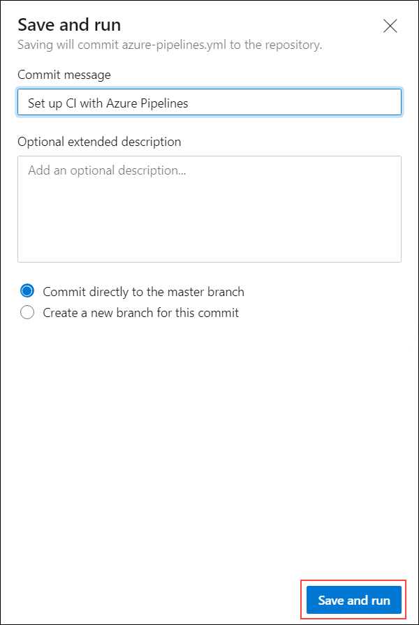

## Exercise 3: Create Azure DevOps build pipeline

Duration: 15 Minutes

Implementing CI and CD pipelines helps to ensure consistent and quality code that's readily available to users. Azure Pipelines is a quick, easy, and safe way to automate building your projects and making them available to users.

In this exercise, you will create a build definition using Azure Pipelines, that will automatically build the web application with every commit of source code. This will lay the groundwork for us to then create a release pipeline for publishing the code to our Azure environments.
  
### Task 1: Create a build pipeline

Pipelines are made of one or more stages describing a CI/CD process. Stages are the major divisions in a pipeline: "build this app", "run these tests", and "deploy to pre-production" are good examples of stages.

Stages consist of one or more jobs, which are units of work assignable to a particular machine. Both stages and jobs may be arranged into dependency graphs: "run this stages before that one" or "this job depends on the output of that job".

Jobs consist of a linear series of steps. Steps can be tasks, scripts, or references to external templates.

This hierarchy is reflected in the structure of a YAML file.

1. In your Azure DevOps project, select the **Pipelines** menu option from the left-hand navigation.

    

2. Select the **Create pipeline** button to create a new build pipeline.

    

3. This starts a wizard where you'll first need to select where your current code is located. In a previous step, you pushed code up to Azure Repos. Select the **Azure Repos Git** option.

    

4. Next, you'll need to select the specific repository where your code was pushed. In a previous step, you pushed it to the **TailspinToys** repository. Select the **TailspinToys** git repository.

    

5. Then, you'll need to select the type of pipeline to configure. Although this pipeline contains a mix of technologies, select **ASP.NET Core** from the list of options.

    

6. As a final step in the creation of a build pipeline, you are presented with a configured pipeline in the form of an azure-pipelines.yml file. 
   
7. This starter YAML file contains a few lines of instructions (shown below) for the pipeline. Let's begin by updating the YAML with more specific instructions to build our application. 

    

The *pool* section specifies which pool to use for a job of the pipeline. It also holds information about the job's strategy for running.

8. Select and replace the *pool* section with the following code:

    ```yml
    pool:
      vmImage: 'windows-latest'
      demands:
      - msbuild
      - visualstudio
      - vstest
    ```

    Steps are a linear sequence of operations that make up a job. Each step runs in its own process on an agent and has access to the pipeline workspace on disk. This means environment variables are not preserved between steps but, file system changes are.

9. Select and replace the *steps* section with the following code:
    
    ```yml
    steps:
    - task: NuGetToolInstaller@0
      displayName: 'Use NuGet 4.4.1'
      inputs:
        versionSpec: 4.4.1      
    ```

    Tasks are the building blocks of a pipeline. They describe the actions that are performed in sequence during an execution of the pipeline.

10. Add additional tasks to your azure-pipelines.yml file by selecting and copying the following code. This should be pasted right after the NuGetToolInstaller@0 task which you pasted previously:
    
    >**Note**: The YAML below creates individual tasks for performing all the necessary steps to build and test our application along with publishing the artifacts inside Azure DevOps so they can be retrieved during the upcoming release pipeline process.

    ```yml
    - task: NuGetCommand@2
      displayName: 'NuGet restore'
      inputs:
        restoreSolution: '**/tailspintoysweb.csproj'

    # Node.js tool installer
    # Finds or downloads and caches the specified version spec of Node.js and adds it to the PATH
    - task: NodeTool@0
      inputs:
        versionSpec: '10.x' 

    - task: VSBuild@1
      displayName: 'Build solution'
      inputs:
        solution: '**/tailspintoysweb.csproj'
        msbuildArgs: '/p:DeployOnBuild=true /p:WebPublishMethod=Package /p:PackageAsSingleFile=true /p:SkipInvalidConfigurations=true /p:PackageLocation="$(build.artifactstagingdirectory)\\"'
        platform: 'any cpu'
        configuration: 'release'

    - task: PublishSymbols@2
      displayName: 'Publish symbols path'
      inputs:
        SearchPattern: '**\bin\**\*.pdb'
        PublishSymbols: false
      continueOnError: true

    - task: PublishBuildArtifacts@1
      displayName: 'Publish Artifact'
      inputs:
        PathtoPublish: '$(build.artifactstagingdirectory)'
        ArtifactName: 'TailspinToys-CI'
      condition: succeededOrFailed()
    ```

11. The final result will look like the following:

    ```yml
    trigger:
      - master

    pool:
      vmImage: 'windows-latest'
      demands:
      - msbuild
      - visualstudio
      - vstest

    steps:
    - task: NuGetToolInstaller@0
      displayName: 'Use NuGet 4.4.1'
      inputs:
        versionSpec: 4.4.1

    # Node.js tool installer
    # Finds or downloads and caches the specified version spec of Node.js and adds it to the PATH
    - task: NodeTool@0
      inputs:
        versionSpec: '10.x' 

    - task: NuGetCommand@2
      displayName: 'NuGet restore'
      inputs:
        restoreSolution: '**/tailspintoysweb.csproj'

    - task: VSBuild@1
      displayName: 'Build solution'
      inputs:
        solution: '**/tailspintoysweb.csproj'
        msbuildArgs: '/p:DeployOnBuild=true /p:WebPublishMethod=Package /p:PackageAsSingleFile=true /p:SkipInvalidConfigurations=true /p:PackageLocation="$(build.artifactstagingdirectory)\\"'
        platform: 'any cpu'
        configuration: 'release'

    - task: PublishSymbols@2
      displayName: 'Publish symbols path'
      inputs:
        SearchPattern: '**\bin\**\*.pdb'
        PublishSymbols: false
      continueOnError: true

    - task: PublishBuildArtifacts@1
      displayName: 'Publish Artifact'
      inputs:
        PathtoPublish: '$(build.artifactstagingdirectory)'
        ArtifactName: 'TailspinToys-CI'
      condition: succeededOrFailed()
    ```

12. Choose the **Save and run** button to save our new pipeline and also kick off the first build.

        

13. The new *azure-pipelines.yml* file will automatically be added to the root of your TailspinToys repository. This is done through a git commit that Azure DevOps facilitates. You are then asked to enter a commit description. By default, it will be populated for you. Once again, select the **Save and run** button at the bottom of the screen.

       

14. The build process will immediately begin and run through the steps defined in the azure-pipelines.yml file. Your Azure DevOps screen will refresh to show you the build process executing, in real-time. 

       

15. After the build process completes, you should see a green check mark next to each of the build pipeline steps.
  
     
    
    Congratulations! You have just created your first build pipeline. In the next exercise, we will create a release pipeline that deploys your successful builds.
