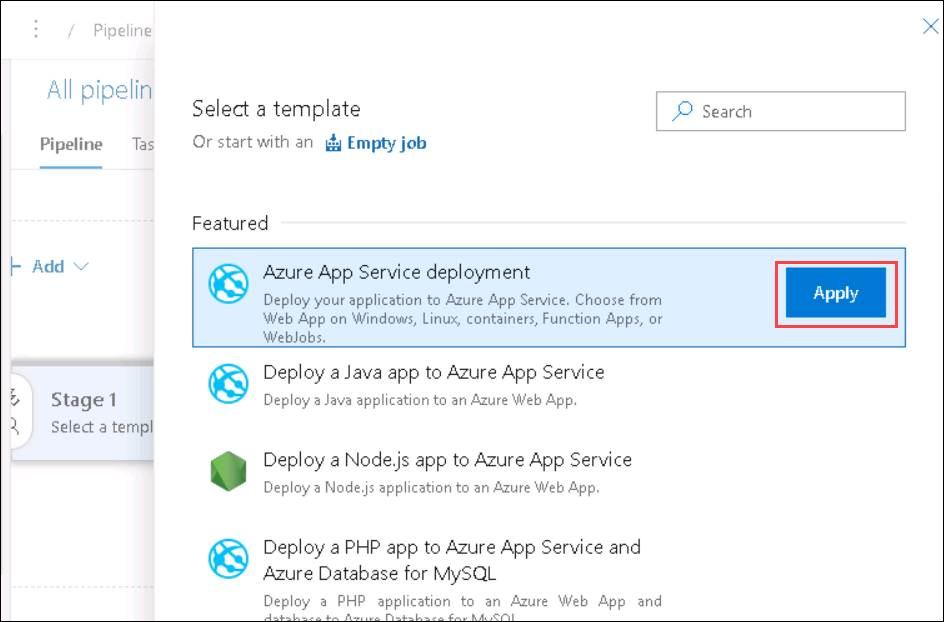
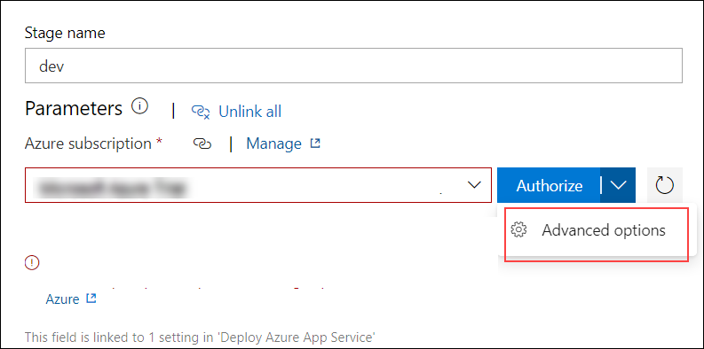
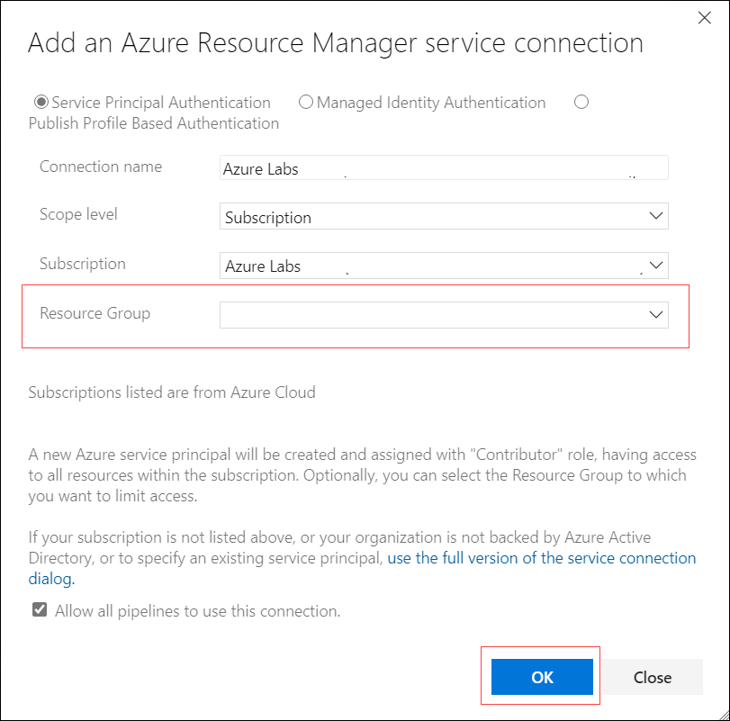
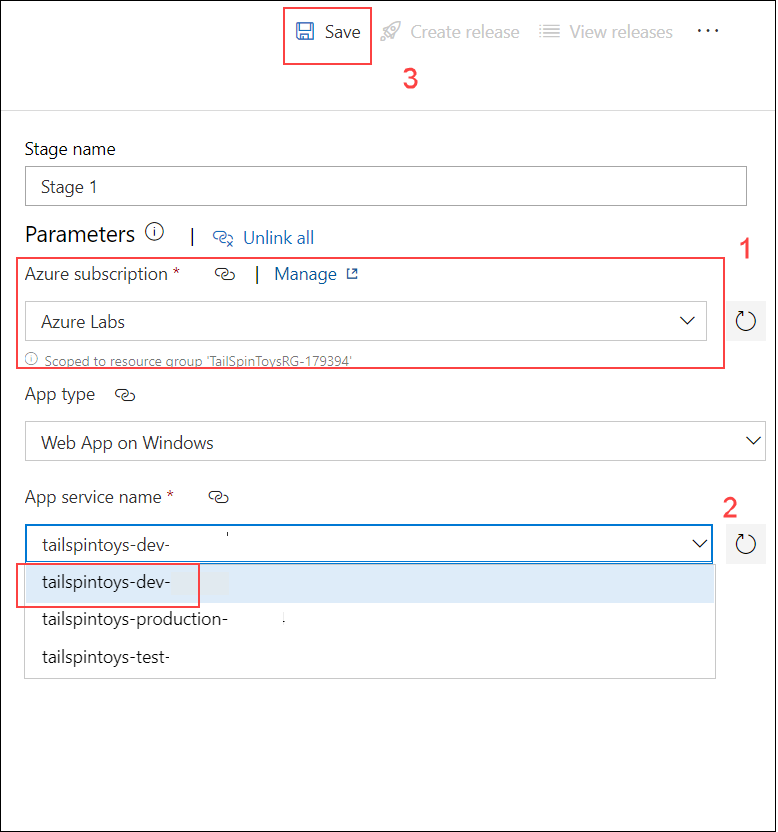
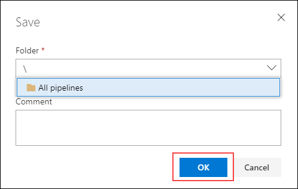

## Exercise 4: Create Azure DevOps release pipeline

Duration: 30 Minutes

In this exercise, you will create a release pipeline in Azure DevOps that performs automated deployment of build artifacts to Microsoft Azure. The release pipeline will deploy to three stages: dev, test, and production.

### Task 1: Create a release definition

1. Select **Releases** on the left-hand navigation. This will bring up the Releases screen. 

    

2. Choose the **New pipeline** button to begin the creation of a new release pipeline.

    

3. Then, you'll need to select the template that matches the pipeline you are building. Since we are deploying an Azure App Service, select **Azure App Service deployment** from the list of templates and choose the **Apply** button.

    

4. This will present you with the New release pipeline editor which allows you to manage your release stages. A stage is a logical and independent concept that represents where you want to deploy a release generated from a release pipeline. Often times, this is considered an environment. Let's start by giving this stage a name. Change the value "Stage 1" in the editor to **"dev"** and then select the **"X"** in the top-right corner to close the panel and save the name change.

    

5. A release consists of a collection of artifacts in your CD/CD process. An artifact is any deployable component of your application. When authoring a release pipeline, you link the appropriate artifact sources to your release pipeline. In this step, we will connect the artifacts from our previously created build pipeline to this newly created release pipeline. Select the **+ Add** button next to *Artifacts* or the **+ Add an artifact** icon inside the *Artifacts* box. Both buttons perform the same action.

    

6. The *Add an artifact* panel will display several configurations for linking to an artifact. 
    
    In the **Source (build pipeline)** dropdown list, select **TailspinToys**. 
    
    In the **Default version** field, select **Latest**. 
    
    The panel fields will adjust to show additional details based on your selection. The default values will produce a new release when future builds successfully complete. 
    
    Select the **Add** button.

    

7. Now, it is time to begin configuring specific tasks to perform our deployment during the dev stage. 

    To navigate to the task editor, select the **Task** menu item.

    

8. This brings up the task editor and opens a panel with configuration details for the dev stage we created earlier. The configuration items set here will be made available to the tasks in this stage.

9. On this panel, we first need to configure the necessary details to connect the task to Azure for deployment. Let's first start by connecting to our Azure subscription. Select your **Azure subscription** from the *Azure subscription* dropdown list and then click the dropdown option next to **Authorize** button and select **Advanced options**.

    
    
10. You will be navigated to **Add an Azure Resource Manager service connection** prompt, Now verify the *Connection name, Scope level and Subscription* and enter the value for **Resource Group** from the drop down list (i.e. TailSpinToysRG) and click **OK**

        

11. Now back in the task editor select the recently created *Azure service connections* from the **Azure subscription option** and from the drop down list of **App service name** select **tailspintoys-dev-xxxx** and click on **Save** button on the top right corner. 

     

12. Then from the drop down option of folders select **All pipelines** and then click on **OK** .

     

13. Now, let's configure the task specific details. Select the **Deploy Azure App Service** task to bring up the configuration panel for task.

    

14. In a previous exercise, we created a deployment slot for the web app. Deployment slots are actually live apps with their own hostnames. App content and configuration elements can be swapped between two deployment slots, including the production slot. 

    In the *Azure App Service Deploy* panel, locate the **Deploy to Slot or App Service Environment** checkbox and set it to checked.

    

15. The checkbox will trigger the panel to update with additional configuration items. 

    In the **Resource group** dropdown, select the appropriate resource group you created in the previous exercise. 
    
    In the **Slot** dropdown, select **staging**.

    

16. Now that we've completed the configuration for the "Deploy Azure App Service" task to deploy our application to Azure App Service deployment slot, we'll need a way to swap the staging slot with the production slot. To do that, we'll need to add an additional task to the dev stage. 

    Select the **+** (plus sign) on the task list to create a new task.

    

17. This opens the *Add tasks* panel. 

    Enter **App Service Manage** into the search box and press **Enter**. 
    
    Then select the **Azure App Service Manage** task from the search results and select the **Add** button.

    

18. After adding the new task, we now have two tasks for the dev stage. The new task now needs to be configured. 

    Select the **Swap Slots:** task to open the task configuration panel.

    

19. In the *Azure App Service Manage* task panel there are a few configurations we need to set. 

    First, locate the *Azure subscription* field and select the same subscription used in the *Deploy Azure App Service* task.

20. Locate the *App Service name* field, select the item that begins with **TailspinToysWeb-dev-** just like in the *Deploy Azure App Service* task. 

    In the *Resource Group* field, select **TailspinToysRg**. 
    
    In the *Source Slot* field, select **staging**.

    

21. Let's wrap up this activity by giving our release pipeline a new name. 

    Choose the existing *New release pipeline* name to begin editing it. 
    
    Change the name to **TailspinToys Release**.

    

22. Select **Save** button at the top of the screen and confirm by selecting the **OK** button.

23. Congratulations! You have just created your first release pipeline.

### Task 2: Add test and production environments to release pipeline

1. On the Pipeline tab, move your mouse over the dev stage and a select the **Clone** button to create a copy of the tasks from the dev stage. We will use the same steps to deploy to test with a few configuration changes.

    

2. Select the newly created stage titled "Copy of dev" to bring up the stage configuration panel.

3. Change the *Stage name* to **test** and then close the panel.

4. Now, we will begin modifying the configuration specifics for the test stage. Select the *1 job, 2 tasks* link for the test stage.

    

5. This opens the configuration panel for the stage and includes several pre-populated fields. 

6. On the *Tasks* tab header option, choose the arrow pointing down, in order to validate that the *test* stage configuration menu is indeed shown.

    

7. In the *Tasks* section, choose on the *test* deployment process to select its stage parameters.

8. Locate the **App service name** parameter and change the value to the app service that starts with **tailspintoys-test-**.

    

9. Select the *Deploy Azure App Service* task to bring up the task configuration panel. Notice the settings are the same as when we configured it for the dev stage because we cloned the dev stage to create the test stage. You may need to scroll down the panel to see additional fields.

10. Locate the **Resource group** field and select the resource group you created earlier. Then, locate the **Slot** field and select **staging**.

    

11. Now, select the *Swap Slots* task to bring up the task configuration panel. 

    First, locate the **Display name** field and simplify it to **Swap Slots**. 
    
    Then, locate the **App Service name** and select the app service that starts with **tailspintoys-test-**. 
    
    Next, locate the **Resource group** field and change the value to the resource group you created earlier. Finally, locate the **Source Slot** field and set it to **staging**.

    

9. Select the **Save** button at the top of the screen and confirm by choosing the **OK** button.

10. Congratulations! You have just created a test stage and added it to your pipeline.

11. **Repeat all of the steps in Task 2 to create a production stage being careful to enter *production* as a replacement for *test* and selecting *tailspintoys-production* instead of *tailspintoys-test* where applicable. Do not forget to configure to individual steps in the newly cloned production environment.**

12. The final release pipeline should look like the screen shot below:

    

13. Now you will enable the continuous deployment trigger, so the release process automatically begins as soon as a build successfully completes. To do this, select the lightning bolt icon in the Artifacts window.

14. This will bring up the *Continuous deployment trigger* panel. Change the setting to **Enabled**.

    

15. Select **Save** and confirm your changes by choosing **OK**. Then, close the panel.

Congratulations! You have completed the creation of a release pipeline with three stages.
