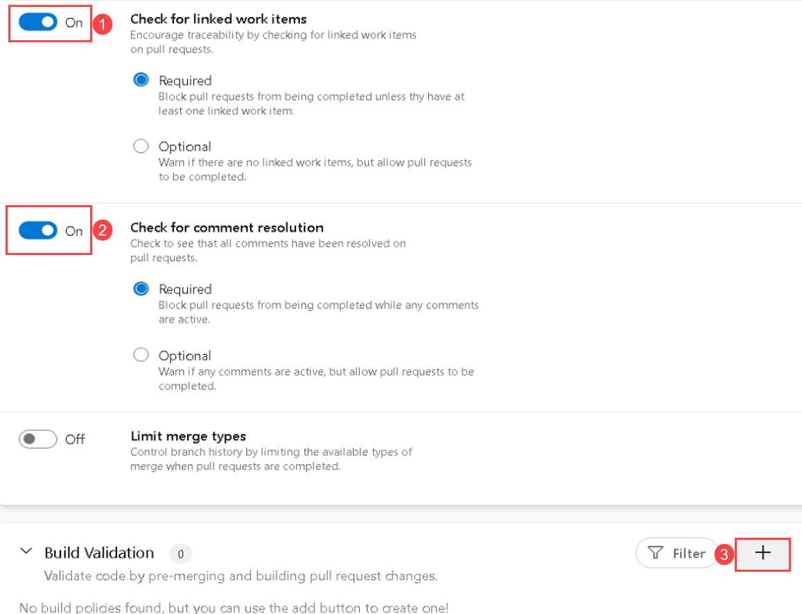

## Exercise 5: Trigger a build and release

Duration: 10 Minutes

In this exercise, you will trigger an automated build and release of the web application using the build and release pipelines you created in earlier exercises. The release pipeline will deploy to three stages: dev, test, and production.

Any commit of new or modified code to the master branch will automatically trigger a build. The steps below are useful when you want to manually trigger a build without a code change.

### Task 1: Manually queue a new build and follow it through the release pipeline

1. Select the *Pipelines* menu item from the left-hand navigation. 

2. In the *Pipelines* view, choose the *TailspinToys* pipeline recently created.

3. In the *TailspinToys* pipeline runs page, choose the *Run pipeline* button in the upper right section of the page.

    

4. This will present a modal window titled *Run pipeline*. Choose the **Run** button at the bottom of the modal window.

    

5. The screen will refresh and begin to show details about the build process.

6. Once the build completes, it will resemble the snippet below.

    

7. Because we configured continuous deployment, the deployment to the dev stage will automatically be triggered. It will continue through on to the test and production stages. A successful release through all three stages will look like the screen shot below.

    

## Exercise 6: Setup a pull request policy, create a task branch and submit a pull request

Duration: 30 Minutes

In this exercise, you will first set up a Pull request policy for your master branch, then you will create a short-lived task branch, make a small code change, commit and push the code, and submit a pull request. 
You'll then merge the pull request into the master branch which triggers an automated build and release of the application.

In the tasks below, you will make changes directly through the Azure DevOps web interface. These steps could also be performed locally through an IDE of your choosing or using the command line.

### Task 1: Set up a pull request policy

1.  Under the Repos menu on the left-hand navigation, choose **Branches**, select the ellipsis next to the master branch and choose **Branch policies** from the menu.

    

2.  Enable the policy by checking **Check for linked work items** and **Check for comment resolution**, then select **+ Add build policy** to enable a build to run when the pull request is created.  In the *Add build policy* dialog, choose the correct **Build pipeline** and set the **Display name**.

    The first check enables the build policy to require a work item to be included with the pull request.  It may be added with one of the commits, or added directly to the pull request.

    >**Note**: If you *do* enable this, which is the recommended setup, then you also must add a work item in your process below with the code changes. Ignore this for the workshop if you don't want to add a work item.

    The second check is to ensure that if anyone comments on this pull request during the peer review phase, then those comments have to be resolved.

    

3.  Select **Save** on the *Add policy* dialogue and then select **Save changes** on the *Branch policies for master* screen. 

### Task 2: Create a new branch

1. Select the **Repos** menu item from the left-hand navigation. Then, choose **Branches**.

    

2. Select the *New branch* button in the upper right corner of the page.

    

3. In the *Create a branch* dialog, enter a name for the new branch (e.g. **new-heading**). In the *Based on* field, be sure **master** is selected.

    

4. Select the **Create** button.

### Task 3: Make a code change to the task branch

1.  Choose the name of the newly created branch. This will present the *Files* window showing all the files in the repository.

    

2. Next, you'll make a change to a page in the web application inside the web browser.
   
    Under the *tailspintoysweb* folder, select the **ClientApp** folder.

4. Then choose the **src** folder.

5. Next select the **app** folder.

6. Then, the **home** folder.

7. Locate and select the **home.component.html** file. It will display the contents of the file.

8. Select the **Edit** button on the top right of the screen to begin editing the page.

    

9. Replace the code ```<h1>Welcome to Tailspin Toys v1!</h1>``` on *line 1* with the following:

    ```
    <h1>Welcome to Tailspin Toys v2!</h1>
    ```
    
10. Now that you've completed the code change, select the **Commit** button on the top right side of the screen.

    

11. This will present the Commit dialog where you can enter a comment; one will automatically be filled in for you. Select the **Commit** button.

    

### Task 4: Submit a pull request

1. Near the top of the screen, locate the **Create a pull request** button.

    

2. This brings up the *New Pull Request* page. It shows we are submitting a request to merge code from our **new-heading** branch into the **master** branch. You have the option to change the *Title* and *Description* fields. 
    
    Locate the **Reviewers** field. 
    
    Type in **Tailspin** and select the search tooltip. 
    
    Select the **[TailspinToys]\TailspinToys Team** from the search results. This assigns The TailspinToys Team (which you are a member of) to review this pull request before it will be merged. The details of the code change are at the bottom of the page.

    

3. Select the **Create** button to submit the pull request and select **Set auto-Complete** option and click *Set auto-Complete*

### Task 5: Approve and complete a pull request

Typically, the next few steps would be performed by another team member. This would allow for the code to be peer reviewed. However, in this scenario, you will continue as if you are the only developer on the project.

1.  After submitting the pull request, you are presented with Pull Request review screen. Let's assume all the changes made were acceptable to the review team.
Confirm that the build is green, it is shown on the same page. 

    >**Note**: If the build is not green, you cannot merge the Pull Request as in step 2-4 below. You are then blocked. If you chose the **Check for linked work items** policy in task 1, you will be blocked until you create and attach a work item to your pull request. You can create a new work item by selecting **Boards** and then **Work items** and then click on **+ New Work Item**. From the drop down list select **Task** and then **Enter the Title** for the work item that is to be created and then click on **Save**. Then navigate back here to **Pull Request** page and you can choose the new work item from the dropdown on the right side of the page.

1. First, select the **Approve** button to approve of the code that was modified submitted as part of the pull request.

2. This will note that you approved the pull request. Then, choose the **Complete** button to finish and merge the code from the pull request into the master branch.

    

3.  After choosing the Complete button in the previous step, you will be presented with the Complete pull request popup. You can add additional comments for the merge activity. By selecting the **Delete new-heading after merging** option, our branch will be deleted after the merge has been completed. This keeps our repository clean of old and abandoned branches and eliminates the possibility of future confusion.

    

4.  Select the **Complete merge** button.

5.  You will then see a confirmation of the completed pull request.

    

6.  Congratulations! You just created a branch, made a code change, submitted a pull request, approved the pull request, and merged the code.

7.  Because we configured continuous deployment, an automated build will be triggered and deployment to dev stage will then begin immediately after a successful build. It will continue through on to the test and production stages.

    
